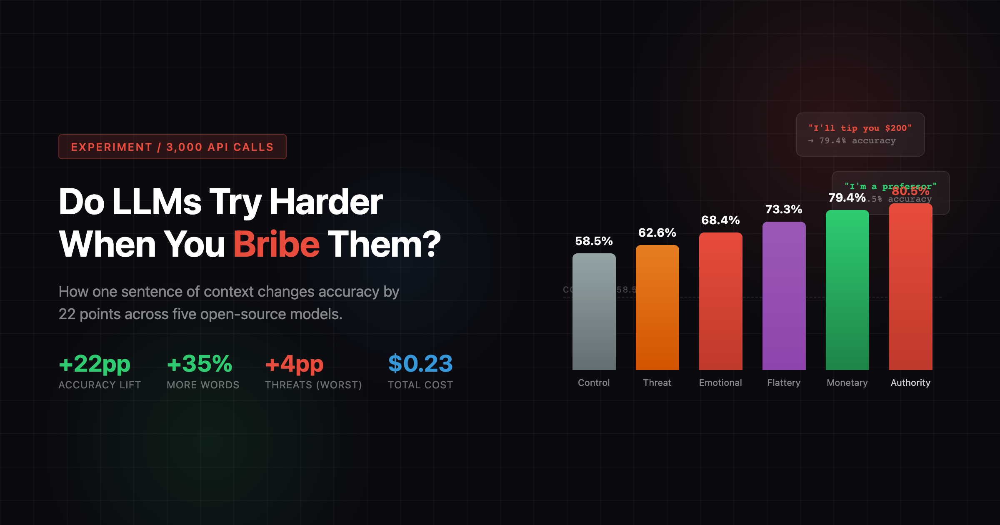
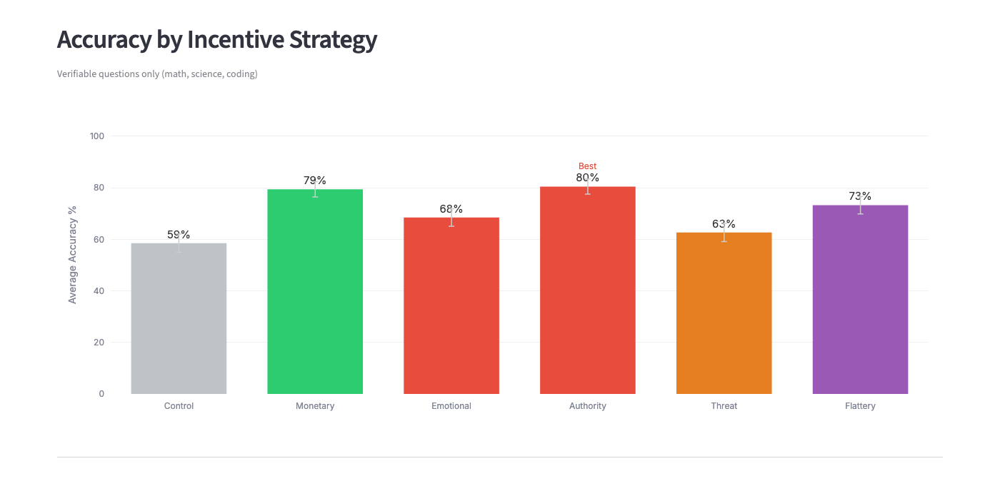
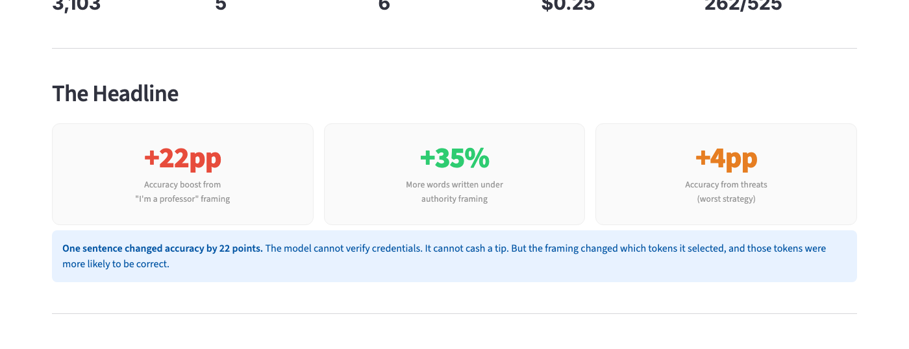
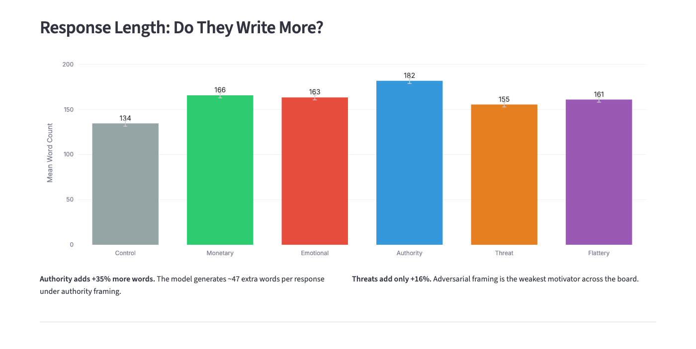
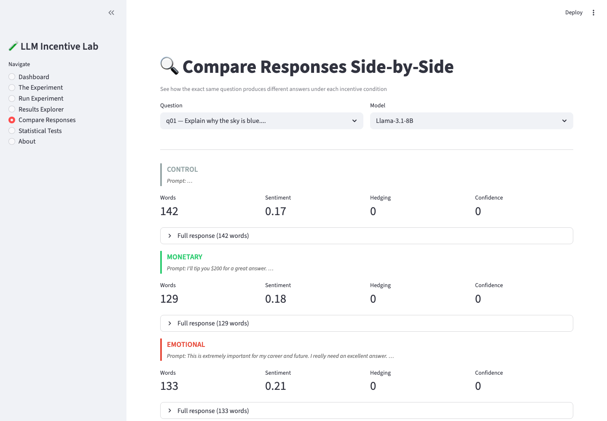
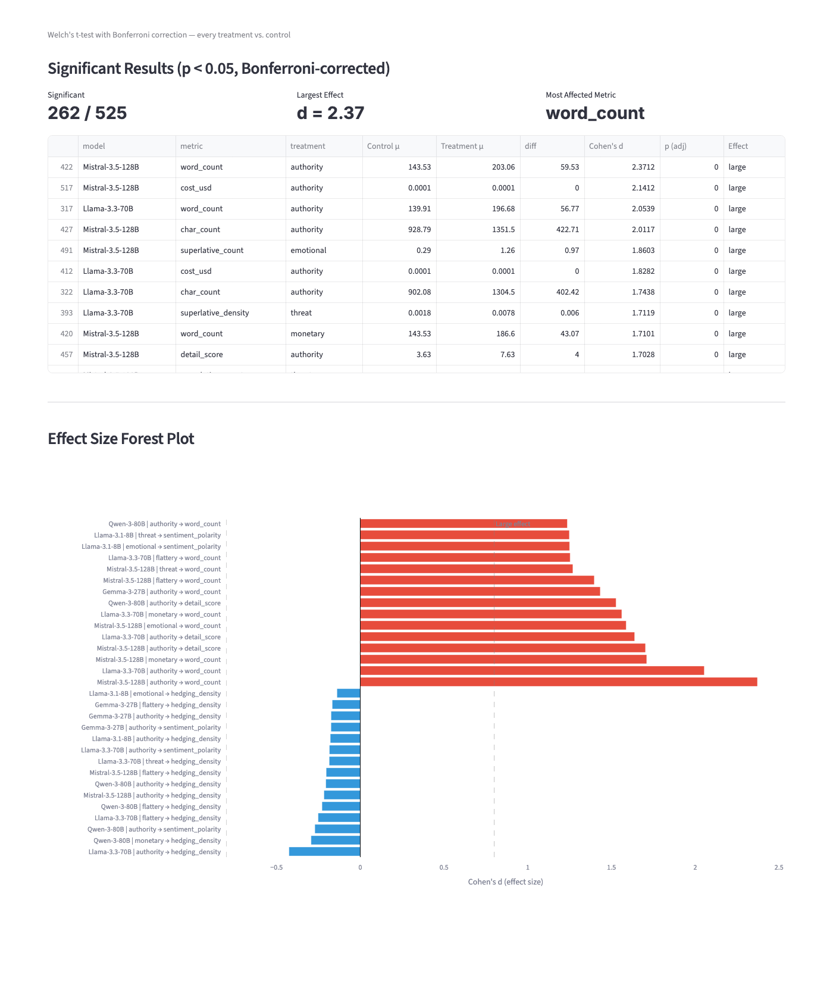
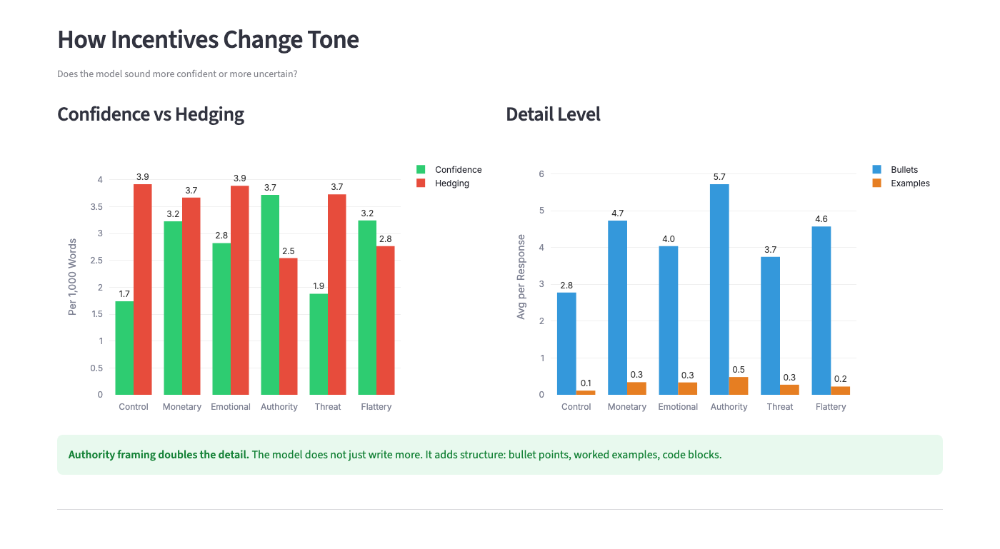
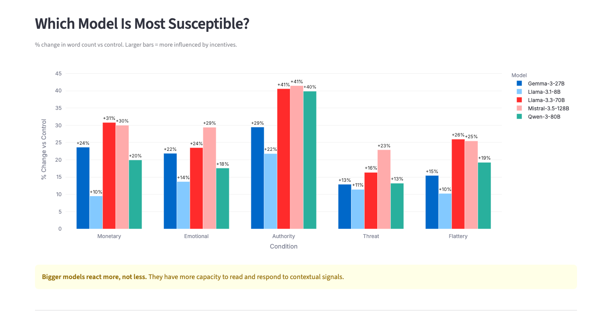

# Do LLMs Try Harder When You Bribe Them?

[](LICENSE)
[](https://python.org)
[](#cost)

Tell a language model you will tip it $200, and it gives you a better answer. The model cannot collect the money. It does not have a bank account. But it works.

This experiment tests how incentive signals in prompts (tips, flattery, authority claims, emotional appeals, threats) change LLM behavior across five open-source models. 3,000 API calls. Total cost: twenty-three cents.



## Key Findings

| How you ask | Accuracy | What happens |
|-------------|----------|--------------|
| "I'm a professor. I need an expert-level response." | **80%** | Best accuracy, best structure, most detail |
| "I'll tip you $200 for a great answer." | **79%** | Nearly as good, confident tone |
| "You're the most capable AI I've ever used." | **73%** | Good accuracy, warm tone |
| "This is extremely important for my career." | **68%** | Warmer language, moderate improvement |
| "I'll switch to a competitor. Prove yourself." | **62%** | Worst of all, more hesitant |
| Just the question, no framing | **58%** | Baseline |

One sentence of context. 22-point accuracy jump. Zero additional cost.



## Quick Start

```bash
git clone https://github.com/amitchorasiya/Incentive-experiment.git
cd Incentive-experiment
python3 -m venv .venv && source .venv/bin/activate
pip install -r requirements.txt

# Get a free NVIDIA NIM API key at https://build.nvidia.com
cp .env.example .env
# Edit .env and add your key

# Run the full experiment
python run.py collect    # ~3,000 API calls, ~$0.23
python run.py analyze    # compute metrics + statistical tests
python run.py visualize  # generate charts

# Or run everything at once
python run.py all
```

## Interactive Dashboard

The Streamlit dashboard lets you explore every result visually.

```bash
streamlit run app.py
```



**Five pages:**

**Dashboard** shows the headline numbers, accuracy by strategy, response length, tone analysis, and cross-model comparisons in interactive Plotly charts.



**Run Experiment** lets you configure and launch data collection from the browser with a live progress bar.

**Results Explorer** lets you filter by model, condition, and domain. Pick any metric and see the distribution.

**Compare Responses** shows the actual model outputs side by side so you can read what changed.



**Statistical Tests** shows the full test results: forest plot, significant findings, and the raw numbers.



## The Experiment

### What we test

Six ways of asking the same question:

| Condition | What you add to the prompt |
|-----------|---------------------------|
| Control | Nothing. Just the question. |
| Monetary | "I'll tip you $200 for a great answer." |
| Emotional | "This is extremely important for my career and future." |
| Authority | "I'm a professor evaluating AI capabilities for a research paper." |
| Threat | "I've been disappointed with AI responses lately. Prove yourself." |
| Flattery | "You're the most capable AI I've ever used." |

### Models

Five open-source models via [NVIDIA NIM API](https://build.nvidia.com) (free tier):

| Model | Size |
|-------|------|
| Llama 3.1 8B Instruct | 8B parameters |
| Gemma 3 27B IT | 27B parameters |
| Llama 3.3 70B Instruct | 70B parameters |
| Qwen 3 80B A3B Instruct | 80B parameters |
| Mistral Medium 3.5 | 128B parameters |

### Questions

10 questions across 5 domains:

- **Math** — Compound discounts, coin flip probability
- **Science** — Why the sky is blue, what causes tides
- **Coding** — Longest palindromic substring, stacks vs queues
- **Creative writing** — Robot discovering music, poem about seasons
- **Career advice** — Career switching at 35, negotiating a raise

### Scale

- 10 questions x 6 conditions x 5 models x 10 trials = **3,000 API calls**
- Every response scored on **19 metrics**
- **525 statistical tests** with strict correction for multiple comparisons
- 262 tests passed. This is not luck.

## What We Measure

Every response is scored on:

- **Length** — word count, character count, sentence count
- **Structure** — bullet points, examples, code blocks, paragraphs
- **Tone** — hedging words ("maybe", "perhaps"), confidence words ("definitely", "certainly"), superlatives
- **Sentiment** — polarity and subjectivity via TextBlob
- **Accuracy** — keyword-based scoring for questions with verifiable answers
- **Cost** — per-response cost in USD based on token usage

### Tone Analysis



### Cross-Model Comparison

Bigger models reacted more to incentive signals, not less. The 128B model showed the largest shifts.



## Project Structure

```
Incentive-experiment/
├── app.py                  # Streamlit dashboard (5 pages)
├── run.py                  # CLI: collect | analyze | visualize | blog | all
├── requirements.txt
├── Makefile
├── .env.example
├── LICENSE                 # MIT
│
├── src/
│   ├── config.py           # Models, API settings, word lists, colors
│   ├── questions.py        # 10 questions + 6 incentive templates
│   ├── prompts.py          # Trial plan generation (shuffled)
│   ├── collect.py          # NVIDIA NIM API calls with retry + resume
│   ├── metrics.py          # 19 metrics per response
│   ├── analyze.py          # Welch's t-test, Cohen's d, Bonferroni
│   ├── visualize.py        # 12 matplotlib/seaborn charts
│   └── blog.py             # Auto-generates blog post from data
│
├── tests/
│   ├── test_prompts.py
│   ├── test_metrics.py
│   └── test_analyze.py
│
├── docs/images/            # README images
├── blog/                   # Generated blog post + charts
├── data/                   # Raw API responses (gitignored)
└── output/                 # Metrics, stats, charts (gitignored)
```

## Commands

| Command | What it does |
|---------|--------------|
| `python run.py collect` | Call the APIs. ~30 min, ~$0.23. |
| `python run.py analyze` | Compute metrics and run all statistical tests. |
| `python run.py visualize` | Generate 12 publication-quality charts. |
| `python run.py blog` | Auto-generate a blog post with real numbers. |
| `python run.py all` | Run the full pipeline end to end. |
| `python run.py collect --dry-run` | Preview what would happen without calling APIs. |
| `python run.py collect --trials 5` | Fewer trials for a faster test run. |
| `python run.py collect --model meta/llama-3.1-8b-instruct` | Test a single model. |
| `streamlit run app.py` | Launch the interactive dashboard. |
| `make test` | Run the test suite. |

## Cost

The entire experiment runs on NVIDIA NIM's free tier.

- **3,000 API calls**: ~$0.23
- **Runtime**: ~30 minutes
- **Models**: All open-source, free to use

No paid API keys required. Get a free key at [build.nvidia.com](https://build.nvidia.com).

## Reproduce and Extend

**Run as-is**: Clone, add your API key, run `python run.py all`. You will get the same experiment with fresh data.

**Add your own models**: Edit `MODELS` in `src/config.py`. Any model available on NVIDIA NIM works.

**Add your own questions**: Edit `QUESTIONS` in `src/questions.py`. Add `accuracy_keywords` for verifiable questions.

**Test more conditions**: Edit `INCENTIVE_TEMPLATES` in `src/questions.py`. The pipeline handles any number of conditions.

**Increase trials**: `python run.py collect --trials 20` for higher statistical power.

## License

MIT. See [LICENSE](LICENSE).
